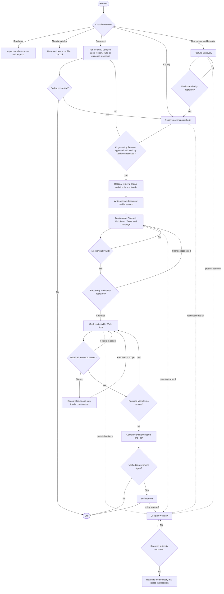

# Harness Workflow Router and State Machine

This router classifies work into two families before durable mutation:
**Document** workflows create or revise authority and knowledge; **Coding**
workflows ground, design, plan, implement, verify, and report repository
changes. A durable Decision may interrupt either family and return to the
boundary that raised it. Exact lifecycle states and authority rules are defined
by [[workflow-lifecycle]].

## Request Classification

| Requested outcome | Route |
| --- | --- |
| Answer, explanation, review, diagnosis, plan, or status | Read only; do not create durable state unless explicitly requested |
| Existing behavior already satisfies the request | Return evidence and stop |
| Feature, Spec, Decision, Report, Rule, or guidance only | Document workflow; complete the applicable document procedure without requiring coding |
| Maintenance inside approved behavior | Coding workflow; reuse the governing Feature or Spec, then Plan |
| Technical-only change with no Feature | Coding workflow; scout code, define objectives, optionally write Plan-local design, and Plan |
| New or changed observable behavior | Document [Feature Workflow](feature.md); all governing Features must be approved before Coding Plan approval |
| Durable product or technical trade-off | [Decision Workflow](decision.md) at the affected boundary |
| Authorized repository implementation | Coding [Plan Workflow](plan.md), then [Cook Workflow](cook.md) |
| Verified Harness improvement signal | [Self-Improve Workflow](self-improve.md) |

Every code change requires an approved Plan. Feature is an authority document,
not a universal pipeline stage. Classification determines whether a new Feature
or Decision is necessary; it does not bypass Plan or verification gates.

## State Machine

## CLI Automation and State Verification

At every supported mechanical boundary, the agent must invoke and consume the corresponding CLI result before manually reasoning about or mutating that state:

- **Feature Workflow**:
  - `ckh feature create --title TITLE [--created YYYY-MM-DD]` to scaffold a Feature.
  - `ckh workflow check TARGET` to validate Feature state/integrity.
  - `ckh feature approve TARGET --approved YYYY-MM-DD --approved-by AUTHORITY` to record Product Authority approval.
  - `ckh feature request-changes TARGET` when Product Authority requests changes.
- **Plan Workflow**:
  - `ckh plan create --title TITLE --work-item TITLE [--work-item TITLE ...] [--created ISO-8601]` to scaffold a Plan and Work Items.
  - `ckh workflow status TARGET` to inspect plan status/blockers.
  - `ckh workflow check TARGET` to check plan mechanical integrity.
  - `ckh plan approve TARGET --decided YYYY-MM-DD` when Repository Maintainer approves.
  - `ckh plan request-changes TARGET --decided YYYY-MM-DD` when Repository Maintainer requests changes.
- **Cook Workflow**:
  - `ckh workflow status TARGET` to determine Work Item eligibility/next steps.
  - `ckh workflow check TARGET` to verify state consistency.
  - `ckh work-item set-status TARGET --status STATUS [--reason TEXT]` to set Work Item status.
  - `ckh plan set-status TARGET --status STATUS [--reason TEXT]` to update aggregate Plan status.

### Review and Change Semantics
- Feature `request-changes` sets/keeps Feature status to `proposed` and clears approval provenance; it does not produce a terminal rejected state.
- Plan `request-changes` sets Plan approval to `changes_requested`, preserves the
  independent execution status, prevents new execution until reapproval, and does
  not produce a terminal rejected state.
- Agents may record declared human approval provenance but must never grant, infer, or invent human approval authority.

### Recovery Boundary and Manual Fallback
The harness CLI operations support `--json` for stable JSON consumption.

If an operation is unsupported or fails, agents must use the named manual fallback path:
1. Manually edit/repair the affected files (markdown, YAML frontmatter) according to canonical schema contracts.
2. Run `ckh validate` (or `ckh validate PATH | --kind KIND | --all`) after manual fallback.
3. Never claim that the failed command itself succeeded.

We preserve a strict recovery boundary: agents do not automatically start Cook,
mutate Git, access the network, start a watcher or daemon, create a database, or
persist hidden state.

## Transition Contracts

1. **Document workflows ([Feature Workflow](feature.md), [Decision Workflow](decision.md), and [Self-Improve Workflow](self-improve.md))**
   - Trigger: new or changed observable behavior, or a request to formalize
     durable product or technical knowledge.
   - Gate: each document follows its own authority; document-only work can end
     without a Coding Plan.
   - Boundary: documentation may overlap coding, but unapproved Feature behavior
     cannot enter an active Plan or Cook.

2. **Decision Workflow ([Decision Workflow](decision.md)) [Interruptible]**
   - Trigger: multiple viable paths have durable, cross-cutting, material, or
     expensive-to-reverse consequences.
   - Gate: Product Authority approves product choices; Repository Maintainer
     approves technical choices.
   - Return: resume Feature, Plan, Cook, or Self Improve at the affected boundary.

3. **Planning ([Plan Workflow](plan.md))**
   - Trigger: approved behavior or explicit technical-only objectives are ready
     for implementation.
   - Preconditions: all governing Features approved; no blocking Decision;
     optional fresh retrieval-artifact grounding plus direct code scout; optional linked sibling
     `design.md`; Work Item/Task decomposition; complete requirement or
     technical-objective coverage.
   - Gates: mechanical validation, then one Repository Maintainer Plan approval.
   - Output: an approved current-shape Plan whose `work-item-XX` children serialize
     Work Items with inline Tasks and executable success criteria.

4. **Cooking ([Cook Workflow](cook.md))**
   - Trigger: Plan approval is approved and the next Work Item has completed
     predecessors and approved Decision dependencies.
   - Gate: no Work Item or required Task completes without concrete passing evidence.
   - Variance: local failures remain in the active Work Item; material authority,
     scope, or success-criteria changes return to Decision or Plan approval.

5. **Reporting ([Cook Workflow](cook.md))**
   - Trigger: all required Work Items and success criteria pass.
   - Output: a completed Delivery Report and completed Plan.
   - Product or high-risk acceptance, when required, belongs in approved Plan
     success criteria; there is no second universal Report approval gate.

6. **Self Improve ([Self-Improve Workflow](self-improve.md)) [Optional]**
   - Trigger: completed Report or approved Decision evidence exposes friction,
     stale guidance, missing validation, or a reusable lesson.
   - Gate: every canonical change requires evidence and human approval; Rule
     promotion still requires two independent occurrences with one recurrence key.

## Artifact Contract

All canonical artifacts use strict YAML frontmatter parsed by the executable
schema. Unknown fields are rejected. Dates use `YYYY-MM-DD`; timestamps use ISO
8601 with an offset.

| Artifact | Location | Filename | Required frontmatter |
| --- | --- | --- | --- |
| Feature | `features/` | `FEAT-XXX-kebab-name.md` | Common fields, `id`, `created`, conditional approval provenance, and `relationships` |
| Spec | `specs/` | `semantic-name.md` | `schema_version`, `type`, `title`, `status`, and `relationships` |
| Decision | `decisions/` | `DEC-XXX-kebab-name.md` | Common fields, `id`, `created`, conditional approval or rejection provenance, and `relationships` |
| Report | `reports/` | `REP-XXX-kebab-name.md` | Common fields, `id`, `delivered`, and `relationships` |
| Rule | `rules/` | `RULE-XXX-kebab-name.md` | Common fields, `id`, `approved`, `scope`, and `relationships` |
| Plan | `plans/YYMMDD-HHmm-slug/` | `plan.md`, optional `design.md`, and `work-item-XX-name.md` | Plan or Work Item fields; `design.md` has no lifecycle frontmatter |

Common artifact fields are `schema_version: 1`, `type`, `title`, `status`, and
`relationships`. Relationship keys are `specs`, `decisions`, `plans`, `reports`,
`rules`, `features`, and `source_paths`; every key contains unique strings.
Wikilinks use `[[full-basename|ID]]` for ID-bearing artifacts and
`[[semantic-basename]]` for Specs. Source paths are repository-relative POSIX
paths without absolute roots, backslashes, or `..` segments.

IDs match `^FEAT-[0-9]{3}$`, `^DEC-[0-9]{3}$`, `^REP-[0-9]{3}$`, or
`^RULE-[0-9]{3}$`. Sequences are monotonic, IDs are immutable and never reused,
and the filename ID must equal the frontmatter ID.

Artifact lifecycle contracts are:

- Features use `draft`, `proposed`, `approved`, `active`, or `deprecated`.
  Approved, active, and deprecated Features require `approved` and
  `approved_by`; draft and proposed Features must not retain that provenance.
- Specs use `draft`, `active`, or `deprecated`.
- Decisions use `proposed`, `approved`, `rejected`, or `superseded`. Approved
  and superseded Decisions require `approved` and `approved_by`; rejected
  Decisions require `rejected`; incompatible provenance must not be retained.
  Optional `supersedes` is a wikilink, and optional `recurrence_key` is non-empty.
- Reports are `completed`, require `delivered`, and may carry non-empty
  `recurrence_key` and boolean `rule_candidate` evidence.
- Rules use `active`, `deprecated`, or `superseded`, require `approved`, and
  require at least one non-empty `scope` entry.

Plan frontmatter requires `title`, `description`, execution `status`, nested
`approval`, `priority`, `effort`, `branch`, `tags`, `blockedBy`, `blocks`,
`relationships`, an offset timestamp in `created`, and `createdBy`; `source` is
optional. Approval status is `pending`, `changes_requested`, or `approved` and
always names `required_by`. Non-pending approval requires `decided`; pending
approval must not retain a decision date.

Plan and Work Item execution status is `pending`, `in_progress`, `blocked`,
`completed`, or `cancelled`. Readers accept the legacy `in-progress` spelling,
but workflows write `in_progress`. Blocked and cancelled state requires
`status_reason`. A Plan cannot be `in_progress` or `completed` without approved
execution authority.

Work Item frontmatter requires positive numeric `work_item`, `title`, status,
priority, effort, positive numeric `dependencies`, and `decision_dependencies`.
Each Decision dependency is a canonical wikilink and must resolve to an approved
Decision before eligibility. Optional Work Item kind, inline Tasks, coverage,
and evidence remain in the Markdown body rather than frontmatter. The Plan body
owns aggregate coverage; there is no Story artifact or Task-level Plan.

Optional implementation `design.md` is plain supporting Markdown stored beside
its owning `plan.md` and linked by the Plan's `relationships.source_paths`. It is
not a lifecycle artifact. Every other Markdown file in a Plan directory must
parse as a Plan or Work Item. Reusable technical contracts belong in semantic
Specs or approved Decisions.

Feature Markdown has exactly five H2 sections: Introduction, Business
Understanding, Requirements, Acceptance, and Relationships. Omit optional
material instead of emitting empty headings. Actors are people, business roles,
or external systems—not classes, services, packages, or modules.

Executable schemas and validators remain authoritative for parsing details;
[[workflow-lifecycle]] defines cross-artifact authority, transition,
aggregation, eligibility, and completion semantics.

## Revision and Terminal Outcomes

- **No change:** Return evidence and end without Plan, Cook, or Report.
- **Feature revision:** Material behavior change returns the Feature to review
  and invalidates affected downstream approval.
- **Plan revision:** Material scope or success-criteria change resets Plan
  approval; routine fixes within approved scope do not.
- **Verification failure:** Preserve user changes and evidence, investigate only
  authorized scope, and never start a dependant Work Item early.
- **Blocked:** Record the concrete condition only when meaningful approved
  progress is impossible.
- **Cancelled:** Preserve completed evidence, record the reason, and never claim
  unfinished work as delivered.
- **Delivered:** Complete from Work Item evidence and a Delivery Report; rejection
  discovered afterward becomes a follow-up change request rather than rewritten history.
