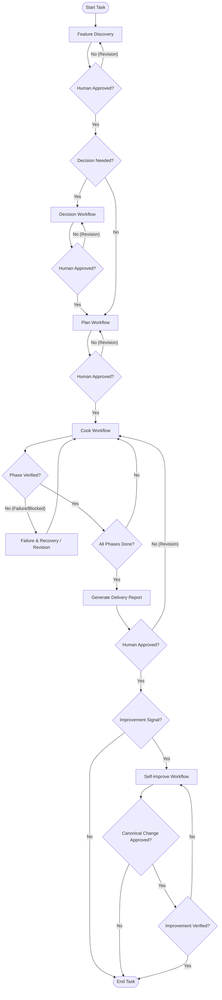

# Harness Workflow Router and State Machine

This router defines the canonical end-to-end state machine for all engineering and product tasks in the repository. It defines how work flows through various workflows and how revisions or rejections are handled.

## State Machine Diagram

## State Transition Definitions

All work proceeds through the following sequential states:

1. **Feature Discovery ([Feature Workflow](feature.md))**
   - **Trigger:** A new capability request or need to document existing behavior.
   - **Activities:** Scouting the repository, identifying evidence, and categorizing into Observed/Inferred/TBD.
   - **Transition Gate:** Human approval of the business boundary. Ends by producing an approved `FEAT-XXX` artifact.

2. **Decision Making ([Decision Workflow](decision.md)) [Optional / As Needed]**
   - **Trigger:** Multiple technical or product approaches are viable, presenting durable trade-offs.
   - **Activities:** Documenting context, presenting 2-3 alternatives, and selecting the simplest viable choice.
   - **Transition Gate:** Human approval of the chosen alternative. Ends by producing an approved `DEC-XXX` artifact.

3. **Planning ([Plan Workflow](plan.md))**
   - **Trigger:** An approved `FEAT-XXX` (and any associated `DEC-XXX` documents) is ready for implementation.
   - **Activities:** Scanning related/unfinished plans, generating a monotonic timestamped plan directory, and creating a phase-by-phase execution plan.
   - **Transition Gate:** Human approval of the plan structure and success criteria. Ends by producing a `plans/YYMMDD-HHmm-slug/` directory with `plan.md` and phase files.

4. **Cooking/Implementation ([Cook Workflow](cook.md))**
   - **Trigger:** A planned implementation is approved.
   - **Activities:** Implementing the plan phase-by-phase, running builds/tests, and gathering concrete evidence.
   - **Transition Gate:** Validation of each phase's success criteria. If blocked, using the exact unavailable-verification disclosure.

5. **Reporting ([Cook Workflow](cook.md))**
   - **Trigger:** All phases of the approved plan are successfully verified.
   - **Activities:** Writing a Delivery Report (`REP-XXX`) from `templates/report.md` capturing outcomes, changed files, verification logs, plan variance, and repeated friction.
   - **Transition Gate:** Human sign-off of the delivered outcomes.

6. **Self Improve ([Self-Improve Workflow](self-improve.md)) [Optional]**
   - **Trigger:** A verified Report or Decision exposes friction, stale guidance,
     missing validation, or a reusable lesson.
   - **Activities:** Classify the signal, search existing guidance, propose the
     smallest improvement, obtain approval, apply it, and verify the result.
   - **Possible outcomes:** No change, retained candidate, Spec/template/workflow
     correction, Decision, policy update, or promoted `RULE-XXX`.
   - **Rule gate:** Promotion still requires two independent occurrences with
     one `recurrence_key` plus explicit human approval.

## Rejection and Revision Loops

If a gate fails, the workflow must loop back to the appropriate previous stage:
- **Feature Revision:** If feature requirements are rejected, return to Discovery.
- **Plan Revision:** If a plan cannot be executed or fails validation, return to Planning to adjust phases, risks, or success criteria.
- **Cook Revision / Failure:** If implementation fails verification, roll back the current phase, address the failure, and re-test. If structurally blocked, seek human guidance to either modify the plan (looping back to Planning) or record the block.
- **Report Revision:** If verification evidence is deemed insufficient, return to the Cook workflow to gather the required logs.
