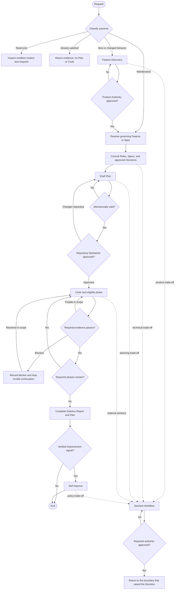

# Harness Workflow Router and State Machine

This router classifies the requested outcome before durable mutation, sends work
to the smallest authoritative workflow, and defines when a durable Decision may
interrupt and return to another workflow. Exact lifecycle states and authority
rules are defined by [[workflow-lifecycle]].

## Request Classification

| Requested outcome | Route |
| --- | --- |
| Answer, explanation, review, diagnosis, plan, or status | Read only; do not create durable state unless explicitly requested |
| Existing behavior already satisfies the request | Return evidence and stop |
| Maintenance inside approved behavior | Reuse the governing Feature or Spec, then Plan |
| New or changed observable behavior | [Feature Workflow](feature.md) |
| Durable product or technical trade-off | [Decision Workflow](decision.md) at the affected boundary |
| Approved implementation work | [Plan Workflow](plan.md), then [Cook Workflow](cook.md) |
| Verified Harness improvement signal | [Self-Improve Workflow](self-improve.md) |

Every code change requires an approved Plan. Classification determines whether
a new Feature or Decision is necessary before planning; it does not bypass Plan
or verification gates.

## State Machine

## Transition Contracts

1. **Feature Discovery ([Feature Workflow](feature.md))**
   - Trigger: new or changed observable behavior, or a request to formalize
     undocumented behavior.
   - Gate: Product Authority approves purpose, scope, behavior, requirements,
     and acceptance.
   - Maintenance inside an approved contract reuses that Feature or Spec.

2. **Decision ([Decision Workflow](decision.md)) [Interruptible]**
   - Trigger: multiple viable paths have durable, cross-cutting, material, or
     expensive-to-reverse consequences.
   - Gate: Product Authority approves product choices; Repository Maintainer
     approves technical choices.
   - Return: resume Feature, Plan, Cook, or Self Improve at the affected boundary.

3. **Planning ([Plan Workflow](plan.md))**
   - Trigger: approved behavior or an existing governing contract is ready for implementation.
   - Gates: mechanical validation, then Repository Maintainer approval.
   - Output: an approved Plan with relationships, phase dependencies, and
     executable success criteria.

4. **Cooking ([Cook Workflow](cook.md))**
   - Trigger: Plan approval is approved and the next phase has completed
     predecessors and approved Decision dependencies.
   - Gate: no phase completes without concrete passing evidence.
   - Variance: local failures remain in the active phase; material authority,
     scope, or success-criteria changes return to Decision or Plan approval.

5. **Reporting ([Cook Workflow](cook.md))**
   - Trigger: all required phases and success criteria pass.
   - Output: a completed Delivery Report and completed Plan.
   - Product or high-risk acceptance, when required, belongs in approved Plan
     success criteria; there is no second universal Report approval gate.

6. **Self Improve ([Self-Improve Workflow](self-improve.md)) [Optional]**
   - Trigger: completed Report or approved Decision evidence exposes friction,
     stale guidance, missing validation, or a reusable lesson.
   - Gate: every canonical change requires evidence and human approval; Rule
     promotion still requires two independent occurrences with one recurrence key.

## Revision and Terminal Outcomes

- **No change:** Return evidence and end without Plan, Cook, or Report.
- **Feature revision:** Material behavior change returns the Feature to review
  and invalidates affected downstream approval.
- **Plan revision:** Material scope or success-criteria change resets Plan
  approval; routine fixes within approved scope do not.
- **Verification failure:** Preserve user changes and evidence, investigate only
  authorized scope, and never start a dependant phase early.
- **Blocked:** Record the concrete condition only when meaningful approved
  progress is impossible.
- **Cancelled:** Preserve completed evidence, record the reason, and never claim
  unfinished work as delivered.
- **Delivered:** Complete from phase evidence and a Delivery Report; rejection
  discovered afterward becomes a follow-up change request rather than rewritten history.
